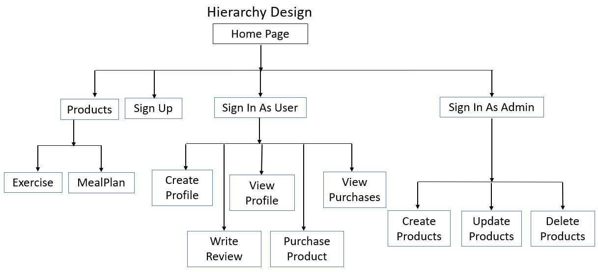
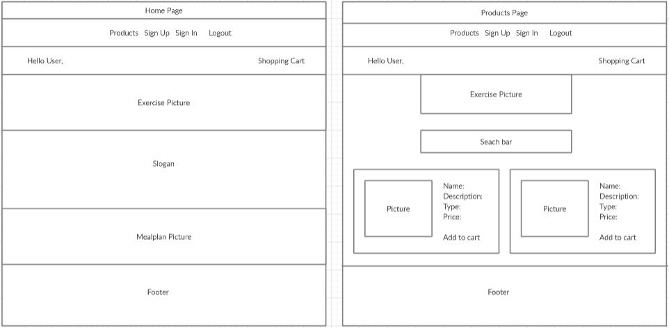
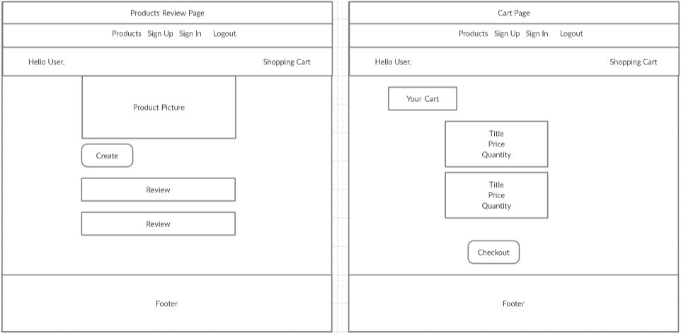
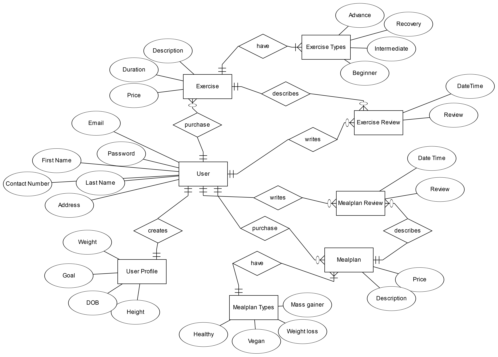
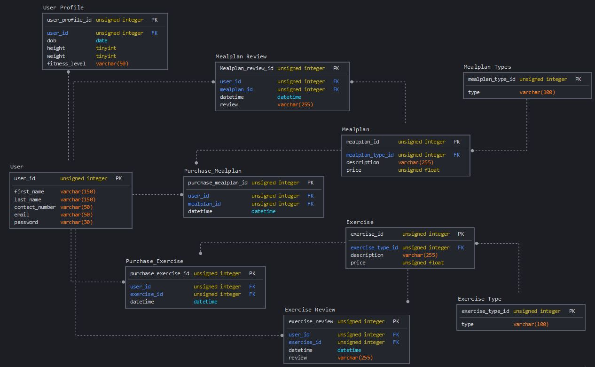

# DAREBee

## Project 4: Full Stack Frameworks with Django

### Context
Seeing how the world has change with the impact of COVID-19, a lot of fitness enthusiast are not able to visit the gym and or outdoors to do their workouts. Rather than be dependent on equipment and facilities to maintain fitness, body weight exercises should be the norm. This way their fitness regime would not be disrupted and they can focus on themselves.

Hence DAREBee was launched to give users the option of body weight exercises that can help improve their fitness. Each purchase of an exercise programmes comes with a booklet and videos on how the exercises can be done. The users are able to keep themselves fit in the comfort of their homes. Not only is exercise important in keeping up a healthy body, having a good diet is also essential. DAREbee also provides mealplans that comes with a recipe book and video on how to prepare a nutrious meal.

There website can be accessed via this link: https://fa-darebee.herokuapp.com
```
Demo Customer Account:
- Login: test
- Password: kitkat123
```
If you would like to sign up as a new user, you can use Temp Mail for a dummy email via this link: https://temp-mail.org/

## UI/UX

### Strategy
User Stories:

- As a customer, I would like to purchase a fitness plan that does not require equipment and I can do at home so that I can keep fit during lockdown or otherwise.

- As a customer, I would to purchase a meal plan that can help me meet my body weight goals without a specialized products during lockdown.

- As a company, we would like to sell fitness plans to consumers who want to exercise anytime and anywhere without the need of equipment so that we can still have business regardless of Covid situation.

- As a company, we would like to be able to sell our meal plans with everyday available items so that our customers can still follow regardless of Covid situation.

### Features
#### Account Authentication
Users can login with their usernames and be able to purchase the products, write reviews, create their profiles and view their purchases. Signing in as an admin will allow creation of products. Depending on who has signed in, the buttons or links will only appear for authorized users. This acts as an added security for all.

#### Shopping Cart and View Purchases
Allows user to add their products into the cart so that transactions can be done in one go. After the purchases have been completed, the user can look at their history which will tell them what they have bought and at what time.

#### Create, Edit and Delete Products
As an admin, products can be created in card form that allows the information to be shown in a concise manner. Pictures can also be uploaded and while making sure that they are the same size to ensure the cards are the same size.

#### Search Functions
Products can be searched for base on their title, type and price to ensure users can find what they want quickly.

#### Email verification
By using the sign up, a verification email will be sent to the user's email and after verification will the user be brought to the sign in page.

### Features Left to Implement
- Links to the product videos and reference material
- Pagination of products
- Rating systems for the product reviews
- Statistics of reports by accident types, violation types

### Structure


- From the homepage the user can look at the products, sign up and sign in
- By signing as an Admin, the user can have access to all the options
- Only by signing in the user purchase a product.

### Wireframe




Navigation bar is located at the top for easy access. Below it is another navbar that will display the user and shopping cart, this will enable the user to see how many items there are in the cart no matter which page it is at. The pictures are displayed prominently to give the user an indication where the user is at. The product display are set at 2 to give the user enough time to look through the displays.

## Technologies Used
1. HTML
2. CSS
3. Javascript
4. Python
5. Django - For creation of the projectBootstrap - For form and card styling
6. django-crispy-forms - For styling the forms
7. dj-database-url - For enabling usage of PostgreSQL
8. Django-allauth - For authentication 
9. SQLite3 - For storing database in Gitpod
10. PostgreSQL - For storing database in Heroku
11. Cloudinary - For uploading images
12. Stripe - For checking out the purchases
13. Psycopg2 - For PostgreSQL adapter
14. Whitenoise - For static files
15. Gunicorn - For running pure-Python HTTP server
16. Heroku -For deploying project
17. Github
18. Gitpod
19. BootStrap
20. Google Fonts

## Programming Methodologies
1. .env file - For storing security features such as Secret Key and Stripe 
2. Gitpod and Github - For source control
3. Heroku - For hosting the project
4. Context processors - For cart to appear in all pages

## Database Design
### ER Diagram


The User has a one to many relationships to Exercise, ExerciseReview, Mealplan and MealplanReview. This relationship is optional as the user may not purchase anything or write a review. However, for each of the entity requrie the User for it's relationship to exist. The User to Profile is one to one and mandatory as the one User can only create one profile. 

### Logical Schema


## Testing

To test as an admin:
```
Admin Account:
- Login: admin
- Password: superuser123
```
To test as a customer:
```
Demo Customer Account:
- Login: test
- Password: kitkat123
```

Automated testing was done on the following routes:

- Home page

- Products
1. Exercise Page
2. Create Exercise Page
3. Update Exercise Page
4. Delete Exercise Page
5. Mealplan Page
6. Create Mealplan Page
7. Update Mealplan Page
8. Delete Mealplan Page

- Customers
1. All Profile Page
2. Create Profile Page
3. Update Profile Page
4. Delete Profile Page

- Cart page

All automated testing is correct at time of test.

### Testing procedure
- Manual testing can be found here
- [Manual Testing Procedure](static/readme/project-4-test-procedure.pdf)

### Known Bugs
- If a user click on view profile before creating a profile it will result in Not Found
- User can make multiple profile which should not be allowed
- If an empty cart is checked out it will result in a Server Error 500

## Deployment
This website is deployed on Heroku. The URL for the deployed website is https://fa-darebee.herokuapp.com/

### Prerequisite
- An IDE e.g. Visual Studio Code or Gitpod
- Account with Heroku
- Account with Cloudinary for image uploading
- Account with Stripe for payment handling
- Account with Gmail for sending out email upon user registration

### To deploy on Heroku

- Download or Clone the master branch from github, https://github.com/Freezefaz/Project-4-DareBee
- To list all the requirements in requirements.txt, run the following command in terminal:
```
- pip3 freeze --local > requirements.txt
```
- Set Debug to False
- Procfile need to be created to run gunicorn upon deployment
```
- Add in Procfile: web: gunicorn DareBeeProject.wsgi:application
- Use heroku login -i in command to access connect to Heroku
```
- Git push to Heroku Master after all the documents are properly set up
- All public keys and private keys for the following need to be added to in Heroku Config Vars settings:
1. SECRET_KEY
2. STRIPE_PUBLISHABLE_KEY
3. STRIPE_SECRET_KEY
4. STRIPE_ENDPOINT_SECRET
5. EMAIL_HOST_PASS
6. EMAIL_HOST_USER
7. TEST_EMAIL
8. CLOUDINARY_CLOUD_NAME
9. CLOUDINARY_API_KEY
10. CLOUDINARY_API_SECRET
11. DATABASE_URL

## Credits

### All Darebee name, exercise, mealplan are all strictly the property of Darebee
### DAREBEE is a non-profit free, ad-free and product placement free global fitness resource. DAREBEE is supported exclusively via user donations
### To support them please visit: https://www.darebee.com/

- Darebee - for their products namely Exercise and Mealplans
- Wireframe - https://creately.com
- Free Logo Design - www.freelogodesign.org
- Pexels - https://www.pexels.com/
- Unsplash - https://unsplash.com/
- Font Awesome - https://fontawesome.com/

